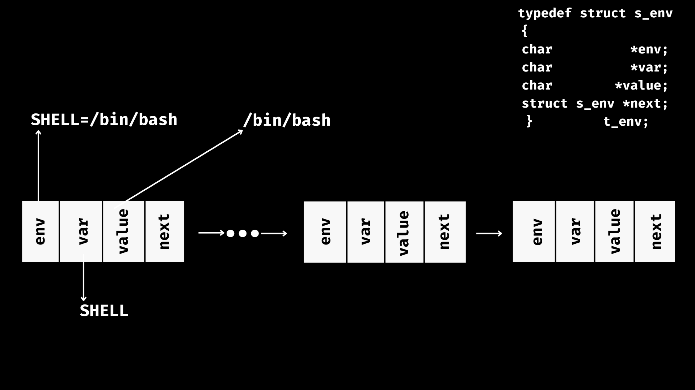
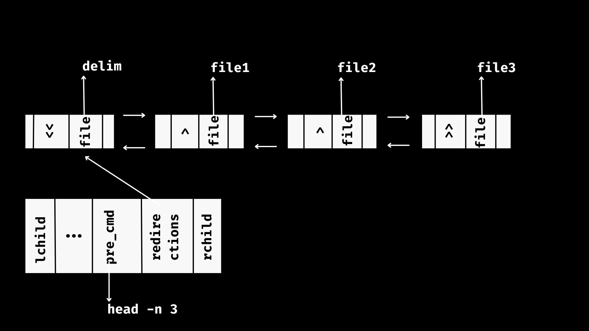
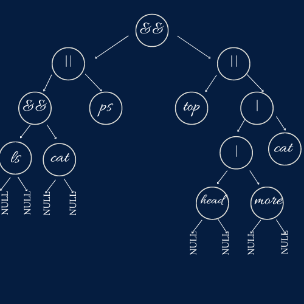

# MINISHELL
`minishell` this project is about creating your own shell with the rules imposed in the subject (look for the subject between repo files).

> PS: Hope you are doing well. In advance, I want to tell that I invested lots of time and energy on this project to make it easy for you to work on since , like most of us, I was too confused when I started it, I didn't know what to do or where to start, I've read so many articles and all the resources that old students suggest in their blogs, But they weren't enough for me to have this general picture about the project. Thus, I've decided to work on this project on my own despite knowing that it would consume a lot of blackhole days, but that was okay if it is going to help you have this general idea at first and instead of wasting time thinking about where to start, you would have enough time  to be creative and invent new ideas. This project is not perfect, I am totally aware of this, but I am sure it's going to be a good starting point. I hope this readme will inspire you.

Contents
========

 * [0. Algorithm/pseudocode](#Algorithm-pseudocode)
 * [1. Initializing](#Initializing)
 * [2. Parsing](#Parsing)
 * [2.1. Tokenizer](#Tokenizer)
 * [2.2. Re-order command](#Re-order-command)
 * [2.3. Build the tree](#Build-the-tree)
 * [3. Executing](#Executing)
 * [3.1. Builtins](#Builtins)
 * [3.2. Executor](#Executor)
 * [3.2.1. and/or](#and-or)
 * [3.2.2. pipes](#pipes)
 * [3.2.3. redirections](#redirections)
 * [3.2.4. command](#command)
 * [3.2.4.1. Expanding](#Expanding)
 * [3.2.4.2. Wildcard *](#Wildcard)
 * [3.2.4.3. executing the command after forking](#execution)
 * [3.2.5. exit status](#exit-status)
 * [4. Tests](#Tests)
 * [5. Resources](#Resources)

### Algorithm pseudocode
---

1. Initializing: 
      - The elements of the struct that is global: The status code + The environment variables. 
      - Saving stdin/stdout using dup. [man dup](https://man7.org/linux/man-pages/man2/dup.2.html)
      - Reading user input command using readline function. [man readline](https://linux.die.net/man/3/readline)
2. Parsing:
      - Building a doubly linked list that holds the command specifying it into tokens using [shell grammar](https://cs61.seas.harvard.edu/site/2019/Section7/).
      - While tokenizing the command I check for syntax errors.
      - Then I re-order the cmd using [Shunting yard algorithm](https://en.wikipedia.org/wiki/Shunting_yard_algorithm) that made it easy for me to build the tree recursively.
      - Building the tree.
3. Executing:
      - Executing the tree recursively bottom-up & from left to right.
      - If the token is and/or/pipe. (This will be explained later)
      - else, the token would be a command. 1. expand $ 2. split the cmd by spaces out of quotes
        -- 3. expand wildcard 4. eliminate main quotes 5. handle redirections 4. check if the cmd is a builtin 
        -- 5. if it is not a builtin, I fork and then execute the cmd using execve.


## Initializing

Replace the environment variables into a linked list so you can delete or add to them later using export and unset builtins.
In addition to displaying them using env or export (without arguments) builtins.


## Parsing
### Tokenizer
---

type of tokens:
```bash
typedef enum e_token
{
	PIPE,     // |
	HEREDOC,  // <<
	LPR,      // (
	RPR,      // )
	AND,      // &&
	OR,       // ||
	APPEND,   // >>
	OUT,      // >
	IN,       // <
	NOT,      // string
	END       // end of cmd
}t_token;
```
The grammar I used:
```
conditional ::=  pipeline
          |   conditional "&&" pipeline
          |   conditional "||" pipeline

pipeline ::=  command
          |   pipeline "|" command

command  ::=  word
          |   redirection
          |   command word
          |   command redirection

redirection  ::=  redirectionop filename
redirectionop  ::=  "<"  |  ">"  |  "2>"
```
- A conditional is a series of pipelines, concatenated by && or ||.
- A pipeline is a series of commands, concatenated by |.
- A redirection is one of <, >, >> or <<, followed by a filename.

While tokenising the cmd I check for syntax errors:

```
Quotes and parentheses should be closed.
if I find a token except a NOT I look for what token is next to it after skipping all wspaces, so that:
after: 

"|" / "&&" / "||" :: NOT / redirection / "("
//EX: 
// $ ls && && ls 
// $ bash: syntax error near unexpected token `&&'

redirection: NOT
//EX:
// $ cat > | head
// $ bash: syntax error near unexpected token `>'

"(" :: "(" / redirections / NOT  PS: before LPR should not be a string, and between parentheses should be a command.
//EX:
// $ ()
// $ (                            )
// $ ls (true && false)
// $ (ls && false
// $ (>file cat))
All of the above examples are syntax errors.

")" :: ")" / "|" / "&&" / "||" / END
//EX:
// $ (false || true)       (
// $ bash: syntax error near unexpected token `)'
```

```
typedef struct s_redir
{
	t_token			tok;
	char			*file;
	bool			flg;
	int				fd;
	struct s_redir	*lchild;
	struct s_redir	*rchild;
}t_redir; //no need to have this linked list doubly.
// struct of the doubly linked list nodes
typedef struct s_node
{
	char			*pre_cmd;
	char			**cmd;
	t_token			tok;
	int				precedence;
	t_redir			*redirections;
	int				fd[2];
	struct s_node	*lchild;
	struct s_node	*rchild;
}t_node;
```

How I deal with redirections:
Let's take this command as example:
```bash
<< delim head >file1>file2 -n 3 >>file3
```
If you look at the struct element of the command you can see a pointer to a linked list for saving redirections.
Since while traversing the command if I find one of the redirections, I save the type of it and the file name. and replace each character 
in the command with the code ascii 127 because it is not a printable character. Ps: at the end I replace the spaces out of quotations with same code ascii and I split by that character.
For the above example we will end up with a node like this:


*/!\ I expand and split the command until execution phase.*

### Re-order command
---
Let's take this command as example: 
```bash
0. $ ls && cat || ps && (top || head | more | cat)
```

I found it a little bit confusing at first building the tree directly from the normal order of the command.
After searching I found out this weki article that helped a lot: [Reverse Polish notation](https://en.wikipedia.org/wiki/Reverse_Polish_notation). Actually, It made it easy for me to build the tree recursively.
And this article led to another more useful one: [Shunting yard algorithm](https://en.wikipedia.org/wiki/Shunting_yard_algorithm)
This is a part of it:
```
In computer science, the shunting yard algorithm is a method for parsing arithmetical or logical expressions, 
or a combination of both, specified in infix notation. It can produce either a postfix notation string, 
also known as Reverse Polish notation (RPN), or an abstract syntax tree (AST).[1] 
The algorithm was invented by Edsger Dijkstra and named the "shunting yard" algorithm because its operation 
resembles that of a railroad shunting yard.
```


There are just three tokens to take their precedence into consediration ("|" / "&&" / "||"). 
The pipe has higher precedence than or/and that have the same precedence.
This algorithm gives also the priority to parentheses so this command root :
```
1. $ ls || ls && ls
```
is not as this command root:
```
2. $ ls || (ls && ls)
```
This is the file where I implemented this algo: [Shunting yard algo implementation](https://github.com/fraqioui/minishell/blob/main/parser/re_order.c).

after the application of the algo the commands will be like this:
```
0. $ ls cat && ps || top head more | cat | || &&
```
```
1. $ ls ls || ls &&
```
```
3. $ ls ls && ls ||
```
You could notice that the root is always the new last element of the command.

### Build the tree
---

After re-ordering the command I've developed this function to build the tree:
```bash
t_node	*list_to_tree(t_node *root)
{
	if (!root)
		return (NULL);
	if (root->tok != NOT)
	{
		root->rchild = list_to_tree(root->lchild);
		root->lchild = list_to_tree(root->lchild);
	}
	if (root->tok == NOT)
	{
		if (root->lchild && root->rchild)
		{
			root->lchild->rchild = root->rchild;
			root->rchild->lchild = root->lchild;
			if (root->rchild->rchild)
				root->lchild->rchild = root->rchild->rchild;
		}
		root->rchild = NULL;
		root->lchild = NULL;
	}
	return (root);
}
```

The last shape of the command before execution:



## Executing

### Builtins
---
1. Export:
	- When you run export on its own, you should display env variables sorted in this shape: 
	```
	$ declare -x HOME="/USER/fraqioui"
	$ declare -x var1
	$ declare -x var=""
	```
	- Export with a variable name should add this var to the environment variables which is the env linked list.
	- The variable Should be an identifier which means that the var should start with an alphabet (uppercase/lowercase)
		or underscore character. In addition the var could contain a number.
		Examples of valid identifiers: Var12, _var12, v_1ar, var1_, _ , ...etc
		Examples of invalid identifiers: 1Var, @var, v+ar, ...etc
	- Before exporting the var you should check first if it already exists.
	Ex:
	```
	$ export var
	//now, var already exists in env variables
	$ export var
	//in this case you should not update this variable
	$ export var=hello
	//now, you should update the value of this variable.
	```
	- If there is a plus before an equal symbol you should append the var value, if there is just an equal symbol you should overwrite the var value.
	- Examples of export:
	```
	$ export var
	$ export =value
	$ export var=
	$ export var=""
	$ export var====value
	$ export var+=value
	$ export var1 var2 var3 var4
	```
2. unset:
	unset builtin deletes a variable from the env variables list.
	Ex: unset var1 var2 var3
3. env: displays the env varibles.
4. pwd: displays the current working directory using getcwd. [man getcwd](https://linux.die.net/man/3/getcwd).
5. exit: cause the shell to exit
	- exit on its own exits the shell with status code 0.
	- exit arguments should be numeric. If it is not, the shell exits with status code 255 after displaying the error message.
	Ex:
	```
	$ exit 76 u74 
	$ bash: exit: numeric argument required
	```
	- exit should not contain more than two arguments.
	Ex:
	```
	$ exit 45 90
	$ bash: exit: too many arguments
	```
	- else, you should exit using exit system call after applying atoi to the string containing exit code. if the exit code reaches long long max or long long min, it turns to exit by -1. 
	- You could check the exit status by : $ echo $?
6. echo with option -n:
	- echo displays its arguments separated by one space.
	- the option -n does not output the trailing newline.
	- One additional case in echo is the several options case.
	Ex:
	```
	$ echo hello "h     llo"      hello
	$ hello h     llo hello
	//////////////////////////
	$ echo -n hello
	$ hello$
	/////////////////
	$ echo "" hello
	$  hello
	///////////////////
	$ echo "     " hello
	$       hello
	/////////////////////
	$ echo -n -n -n hello
	$ hello$
	//////////////////
	$ echo -nnnnnnnnnnnn hello
	$ hello$
	//////////////////////
	$ echo -nnnnnnnnnnn -nnnnnnnnnn -nnnnnnnnn -nnnnnno hello
	$ -nnnnnno hello$
	/////////////////
	$ echo - hello
	$ - hello
	////////////
	```
7. cd:
	- change current working directory using chdir. [man chdir](https://linux.die.net/man/3/chdir).
	- cd on its own leads to HOME. Check if HOME is set.
	- cd with arguments leads to the specified directory.
	- After changing directory you should update the OLDPWD and the PWD between env variables if they don't exist add them.
	- strerror with errno will display the right error message. For example, if the path is not a directory or if the directory does not exist.

### Executor
### and or
---
1. AND: if the exit status of the left side of "&&" is 0, then run the right side.
2. OR: if the exit status of the left side of "||" is different from 0, then run the right side.

### pipes
---
I explained more the pipes in pipex project, check this linkk: [pipex](https://github.com/fraqioui/pipex).

### redirections:
---
Traverse The redirections list, look for heredocs, open all of them firstly and read input using readline. The best way to save the input is by using pipe system call by writing to the writing end of the pipe and returning the fd of the reading end as an input file. If the delimiter does not include quotes you should expand inside heredoc, else you shouldn't.
```C
int	handle_heredoc(char *delim, bool flg)
{
	int	fd[2];
	char	*input;
	char	*save;

	if (pipe_sc(fd) < 0)
		return (-1);
	while (1)
	{
		input = readline("> ");
		if (!input || !ft_memcmp(input, delim, ft_strlen(input) + 1))
		{
			free(input);
			break ;
		}
		if (flg)
			input = expand_in_doc(input);
		save = ft_strjoin(input, "\n");
		(free(input), input = save);
		if (_write_(fd[1], input, ft_strlen(input)) < 0)
			return (free(input), -1);
		(free(input), input = NULL);
	}
	return (close(fd[1]), fd[0]);
}
```
Then, open other files.
1. Input files for read only.
2. Output files for create, write only, and truncate.
3. Append files for create, write only, and append.

## command
### Expanding
---
1. Do not expand inside single quotes and do not expand heredoc delimiter.
2. Expand in other cases.
3. develop your own getenv function that gets variable value form the env list you would build.
4. don't split command before expand.
	- EX:
	```bash
	$ export var="ls -la"
	$ $var
	//it should work
	```
### Wildcard
---
DIRECTORY ACCESS

In the Linux file system, a directory contains the names and i-numbers of files stored in it. Library functions are available for accessing directories. To use any of them, be sure to include these header files:

#include <sys/types.h>

#include <dirent.h>

To open a directory, use either

	DIR *opendir(const char *dir) (opens directory stream)

or

	DIR *fdopendir(int fd) (opens directory stream)

I/O and Process Control System Calls to obtain a directory stream pointer (DIR *) for use in subsequent operations. If the named
directory cannot be accessed, or if there is not enough memory to hold the contents of the directory, a NULL (invalid pointer) is returned. Once a directory stream is opened, the library function readdir is used to sequentially access its entries. The function

#include <sys/types.h>

#include <dirent.h>

	struct dirent *readdir(DIR *dp) (returns next dir entry from dp)

returns a pointer to the next directory entry. The pointer value becomes NULL on error or reaching the end of the directory.
The directory entry structure struct dirent records information for any single file in a directory.
```
struct dirent
{ 
	ino_t d_ino; /* i-node number of file */
	off_t d_off; /* offset to the next dirent */
	unsigned short d_reclen; /* length of this record */
	unsigned char d_type; /* file type */
	char d_name[256]; /* filename */
};
```
Each file in a filesystem also has a unique i-node number. The NAME_MAX constant, usually 255, gives the maxima length of a directory entry name. The data structure returned by readdir can be overwritten by a subsequent call to readdir.
The function

closedir(DIR *dp) (closes directory stream)

closes the directory stream dp and frees the structure associated with the DIR pointer.

Firstly, you open the current working directory ".", and read it. While reading the directory files, you should compare the pattern by those files. I used this algo which is an easy and effective algo. [Dynamic Programming | Wildcard Pattern Matching](https://www.geeksforgeeks.org/dynamic-programming-wildcard-pattern-matching-linear-time-constant-space/).

PS: 
1. you should not expand wildcard inside quotes.
2. you should not display hidden files that starts with "." except for one case, if the pattern starts with a dot ".".

EX:
```bash
$ ls *
$ ls *****************
$ ls "*.c" '*.c' *.c
$ ls m*************n*l
$ ls .*
$ ls *.*********

```
### execution
---
After expanding, I split the command by 127 character. and then eleminate main quotes. Ex: "'don't' forget" becomes 'don't' forget.
I check if the command is a builtin to run the specified builtin. else:
1. Forking.
2. looking for command path.
3. executing command using execve system call.

## exit status
A command which exits with a zero exit status has succeeded. A non-zero exit status indicates failure.
When a command terminates on a fatal signal whose number is N, Bash uses the value 128+N as the exit status.
If a command is not found, the child process created to execute it returns a status of 127. If a command is found but is not executable, the return status is 126.
In case of incorrect usagem the return status is 258.

## Tests
```bash
$ ls | ls | ls | ls | ls | ls | ls | ls | ls | ls | ls | ls 
$ ls" | cat"
$ ls """
$ ls "don't"
$ l"s"""
$ l"'s'"
$ .
$ ..
$ export var0="head -"
$ export var1="n 1"
$ export var2="0"
$ echo $var0$var1$var2
$ head -n 10
$ $var0$var1$var2 //it should work
$ <<$x cat
$ <<   l"" cat
$ <<l cat
$ cat >$x
$ <file1
$ <<delim
$ cd
$ /bin/ls
// test this in bash
1. $ mkdir test
2. $ cd test
3. $ rm -rf ../test
4. $ pwd
5. $ cd . //this is gonna display an error

$ ls >file1>file2>>file3
$ << l << delim << dl cat
1. $ touch file1
2. $ chmod 000 file1
3. $ cat >file0>file1>file3
//error
4. cd file1
//
1. $ unset path
2. $ ls
3. $ /bin/ls
//
$ env -i ./minishell
//
1. $ grop
2. $ echo $?
//
1. $ cc test.c
2. $ chmod 000 a.out
3. $ ./a.out
4. $ echo $?
//
1. $ cat
CTR ^C
2. $ echo $?
//
$ echo $HOME
$ echo $HOMEsdjhfk$HOME
$ echo $HOME.sdjhfk$HOME
```

## Resources:
- https://en.wikipedia.org/wiki/Shunting_yard_algorithm
- https://www.engr.mun.ca/~theo/Misc/exp_parsing.htm
- https://en.wikipedia.org/wiki/Reverse_Polish_notation
- https://en.wikipedia.org/wiki/Backus%E2%80%93Naur_form
- https://cs61.seas.harvard.edu/site/2019/Section7/
- https://brilliantorg-infra-prod.brilliant.org/wiki/shunting-yard-algorithm/
- https://www.codequoi.com/en/sending-and-intercepting-a-signal-in-c/
- https://www.codequoi.com/en/errno-and-error-management-in-c/
- https://www.codequoi.com/en/pipe-an-inter-process-communication-method/
- https://www.gnu.org/software/bash/manual/html_node/Exit-Status.htm
- https://www.gnu.org/software/bash/manual/html_node/Signals.html
- https://www.ibm.com/docs/en/zos/2.3.0?topic=functions-waitpid-wait-specific-child-process-end


I hope this was a good starting point for you to begin minishell with a clear mind.
