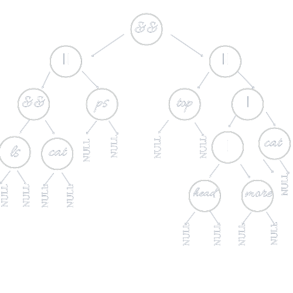

# MINISHELL
`minishell` this project is about creating your own shell with the rules imposed in the subject (look for the subject between repo files).
//example of the work

> PS: In advance, I wanted to tell that I invested lots of time and energy on this project to make it easy for you to work on since I was 
> too confused when I started it, I didn't know what to do or from where to start. I've read a lot of articles and went from all the resources 
> that old students suggests in their articles, But always those articles weren't enough for me to have this general picture about the project.
> Thus, I've decided to work on this project on my own besides knowing that it would consume a lot of blackhole days, but that was okay 
> for me knowing that I would get out with a general picture of the project. So the people working on the project and the next promos wouldn't 
> suffer from this, and instead of wasting time thinking about where to start, they would have enough to be creative and invent new ideas
> I would be proud of them. This project is not perfect and I am totally aware of this, but I am sure it's gonna be a good starting point
> Hope it is going to inspire you. You should not do none of the ideas if they didn't fit you but they just an inspiration.

Contents
========

 * [0. Algorithm/pseudocode](#Algorithm-pseudocode)
 * [1. Initializing](#Initializing)
 * [2. Parsing](#Parsing)
 * [2.1. Tokenizer](#Tokenizer)
 * [2.2. Re-order command](#Re-order-command)
 * [2.3. Build the tree](#Build-the-tree)
 * [3. Executing](#Executing)
 * [3.1. Builtins](#Builtins)
 * [3.2. Executor](#Executor)
 * [3.2.1. and/or](#and-or)
 * [3.2.2. pipes](#pipes)
 * [3.2.3. redirections](#redirections)
 * [3.2.4. command](#command)
 * [3.2.4.1. Expanding](#Expanding)
 * [3.2.4.2. Wildcard *](#Wildcard)
 * [3.2.4.3. executing the command after forking](#execution)
 * [4. Resources](#Resources)

### Algorithm pseudocode
---

1. Initializing: 
      - The elements of the struct that is global: The status code + The environment variables. 
      - Saving stander input / stander output using dup. [man dup](https://man7.org/linux/man-pages/man2/dup.2.html)
      - Reading user input command using readline function. [man readline](https://linux.die.net/man/3/readline)
2. Parsing:
      - Building a doubly linked list that holds the command specifying it into tokens using [shell grammar](https://cs61.seas.harvard.edu/site/2019/Section7/).
      - While tokenizing the command I check for syntax errors.
      - Then I re-order the cmd using [Shunting yard algorithm](https://en.wikipedia.org/wiki/Shunting_yard_algorithm) that made it easy for me to build the tree recursively.
      - Building the tree.
3. Executing:
      - Executing the tree recursively bottom-up & from left to right.
      - If the token is and/or/pipe. (This would be explained later)
      - else, the token would be a command. 1. expand $ 2. split the cmd by spaces out of quotes
        -- 3. expand wildcard 4. eliminate main quotes 5. handle redirections 4. check if the cmd is a builtin 
        -- 5. if it is not a builtin, I fork and then execute the cmd using execve.


## Initializing

Replace the environment variables into a linked list so you can delete or add to them later using export and unset builtins.
In addition to displaying them using env or export (without arguments) builtins.


## Parsing
### Tokenizer
---

type of tokens:
```bash
typedef enum e_token
{
	PIPE,     // |
	HEREDOC,  // <<
	LPR,      // (
	RPR,      // )
	AND,      // &&
	OR,       // ||
	APPEND,   // >>
	OUT,      // >
	IN,       // <
	NOT,      // string
	END       // end of cmd
}t_token;
```
The grammar I used:
```
conditional ::=  pipeline
          |   conditional "&&" pipeline
          |   conditional "||" pipeline

pipeline ::=  command
          |   pipeline "|" command

command  ::=  word
          |   redirection
          |   command word
          |   command redirection

redirection  ::=  redirectionop filename
redirectionop  ::=  "<"  |  ">"  |  "2>"
```
- A conditional is a series of pipelines, concatenated by && or ||.
- A pipeline is a series of commands, concatenated by |.
- A redirection is one of <, >, >> or <<, followed by a filename.

While tokenising the cmd I check for syntax errors:

```
Quotes and parentheses should be closed.
if I find a token except a NOT I look for what token is next to it after skipping all wspaces, so that:
after: 

"|" / "&&" / "||" :: NOT / redirection / "("
//EX: 
// $ ls && && ls 
// $ bash: syntax error near unexpected token `&&'

redirection: NOT
//EX:
// $ cat > | head
// $ bash: syntax error near unexpected token `>'

"(" :: "(" / redirections / NOT  PS: before LPR should not be a string, and between parentheses should be a command.
//EX:
// $ ()
// $ (                            )
// $ ls (true && false)
// $ (ls && false
// $ (>file cat)
All of the above examples are syntax errors.

")" :: ")" / "|" / "&&" / "||" / END
//EX:
// $ (false || true))
// $ bash: syntax error near unexpected token `)'
```

```
typedef struct s_redir
{
	t_token			tok;
	char			*file;
	bool			flg;
	int				fd;
	struct s_redir	*lchild;
	struct s_redir	*rchild;
}t_redir;
// struct of the doubly linked list nodes
typedef struct s_node
{
	char			*pre_cmd;
	char			**cmd;
	t_token			tok;
	int				precedence;
	t_redir			*redirections;
	int				fd[2];
	struct s_node	*lchild;
	struct s_node	*rchild;
}t_node;
```

How I deal with redirections:
Let's take this command as example:
```bash
<< delim head >file1>file2 -n 3 >>file3
```
If you look at the struct element of the command you can see a pointer to a linked list for saving redirections.
Since while traversing the command if I find one of the redirections, I save the type of it and the file name. and replace each character 
in the command with the code ascii 127 because it is not a printable character. Ps: at the end I replace the spaces out of quotetions with same code ascii and I split by that character.
For the above example we will end up with a node like this:


*/!\ I expand and split the command until execution phase.*

### Re-order command
---
Let's take this command as example: 
```bash
0. $ ls && cat || ps && (top || head | more | cat)
```

I found it a bit confusing at first building the tree directly from the normal order of the command.
After searching I found out this weki article that helped a lot: [Reverse Polish notation](https://en.wikipedia.org/wiki/Reverse_Polish_notation). Actually, It made it easy for me to build the tree recursively.
And this article led to another more useful one: [Shunting yard algorithm](https://en.wikipedia.org/wiki/Shunting_yard_algorithm)
This is a part of it:
```
In computer science, the shunting yard algorithm is a method for parsing arithmetical or logical expressions, 
or a combination of both, specified in infix notation. It can produce either a postfix notation string, 
also known as Reverse Polish notation (RPN), or an abstract syntax tree (AST).[1] 
The algorithm was invented by Edsger Dijkstra and named the "shunting yard" algorithm because its operation 
resembles that of a railroad shunting yard.
```


There are just three tokens to take their precedence into consediration ("|" / "&&" / "||"). 
The pipe has higher precedence than or/and that have the same precedence.
This algorithm gives also the priority to parentheses so this command root :
```
1. $ ls || ls && ls
```
is not as this command root:
```
2. $ ls || (ls && ls)
```
This is the file where I implemented this algo: [Shunting yard algo implementation](https://github.com/fraqioui/minishell/blob/main/parser/re_order.c).

after the application of the algo the commands will be like this:
```
0. $ ls cat && ps || top head more | cat | || &&
```
```
1. $ ls ls || ls &&
```
```
3. $ ls ls && ls ||
```
You could notice that the root is always the new last element of the command.

### Build the tree
---

After re-ordering the command I've developed this function to build the tree:
```bash
t_node	*list_to_tree(t_node *root)
{
	if (!root)
		return (NULL);
	if (root->tok != NOT)
	{
		root->rchild = list_to_tree(root->lchild);
		root->lchild = list_to_tree(root->lchild);
	}
	if (root->tok == NOT)
	{
		if (root->lchild && root->rchild)
		{
			root->lchild->rchild = root->rchild;
			root->rchild->lchild = root->lchild;
			if (root->rchild->rchild)
				root->lchild->rchild = root->rchild->rchild;
		}
		root->rchild = NULL;
		root->lchild = NULL;
	}
	return (root);
}
```

The last shape of the command before execution:



## Executing

### Builtins
---
1. Export:
	- When you run export on its own, you should display env variables sorted in this shape: 
	```
	$ declare -x HOME="/USER/fraqioui"
	$ declare -x var1
	$ declare -n var=""
	```
	- Export with a variable name should add this var to the environment variables which is the env linked list.
	- The variable Should be an identifier which means that the var should start with an alphabet (uppercase/lowercase)
		or underscore character. In addition the var could contain a number.
		Examples of valid identifiers: Var12, _var12, v_1ar, var1_, _ , ...etc
		Examples of invalid identifiers: 1Var, @var, v+ar, ...etc
	- Before exporting the var you should check first if it already exists.
	Ex:
	```
	$ export var
	//now, var already exists in env variables
	$ export var
	//in this case you should not upadte this variable
	$ export var=hello
	//now, you should update the value of this variable.
	```
	- If there is a plus before an equal sign you should append the var value, if there is just an equal sign you should overwrite the var value.
	- Examples of export:
	```
	$ export var
	$ export =value
	$ export var=
	$ export var=""
	$ export var====value
	$ export var+=value
	$ export var1 var2 var3 var4
	```
2. unset:
	unset builtin deletes a variable from the env variables list.
	Ex: unset var1 var2 var3
3. env: displays the env varibles.
4. pwd: displays the current working directory using getcwd. [man getcwd](https://linux.die.net/man/3/getcwd).
5. exit: cause the shell to exit
	- exit on its own exits the shell with status code 0.
	- exit arguments should be numeric. If it is not, the shell exits with status code 255 after displaying the error message.
	Ex:
	```
	$ exit 76 u74 
	$ bash: exit: numeric argument required
	```
	- exit should not contain more than two arguments.
	Ex:
	```
	$ exit 45 90
	$ bash: exit: too many arguments
	```
	- else, you should exit using exit system call after applying atoi to the string containing exit code. if the exit code reaches long long max or long long min, it turns to exit by -1. 
	- You could check the exit status by : $ echo $?
6. echo with option -n:
	- echo displays its arguments separated by one space.
	- the option -n does not output the trailing newline.
	- One additional case in echo is the several options case.
	Ex:
	```
	$ echo hello "h     llo"      hello
	$ hello h     llo hello
	//////////////////////////
	$ echo -n hello
	$ hello$
	/////////////////
	$ echo "" hello
	$  hello
	///////////////////
	$ echo "     " hello
	$       hello
	/////////////////////
	$ echo -n -n -n hello
	$ hello$
	//////////////////
	$ echo -nnnnnnnnnnnn hello
	$ hello$
	//////////////////////
	$ echo -nnnnnnnnnnn -nnnnnnnnnn -nnnnnnnnn -nnnnnno hello
	$ -nnnnnno hello$
	/////////////////
	$ echo - hello
	$ - hello
	////////////
	```
7. cd:
	- change current working directory using chdir. [man chdir](https://linux.die.net/man/3/chdir).
	- cd on its own leads to HOME. Check if HOME is set.
	- cd with arguments leads to the specified directory.
	- After changing directory you should update the OLDPWD and the PWD between env variables if they don't exist add them.
	- strerror with errno will display the right error message. For example, if the path is not a directory or if the directory does not exist.

### Executor
### and or
---
1. AND: if the exit status of the left side of "&&" is 0, then display the right side.
2. OR: if the exit status of the left side of "||" is different from 0, then display the right side.

### pipes
---
I explained more the pipes in pipex project, check this linkk: [pipex](https://github.com/fraqioui/pipex).

### redirections:
---


## Resources:
- https://en.wikipedia.org/wiki/Shunting_yard_algorithm
- https://www.engr.mun.ca/~theo/Misc/exp_parsing.htm
- https://en.wikipedia.org/wiki/Reverse_Polish_notation
- https://en.wikipedia.org/wiki/Backus%E2%80%93Naur_form
- https://cs61.seas.harvard.edu/site/2019/Section7/
- https://brilliantorg-infra-prod.brilliant.org/wiki/shunting-yard-algorithm/
- https://www.codequoi.com/en/sending-and-intercepting-a-signal-in-c/
- https://www.codequoi.com/en/errno-and-error-management-in-c/
- https://www.codequoi.com/en/pipe-an-inter-process-communication-method/
- https://www.gnu.org/software/bash/manual/html_node/Exit-Status.htm
- https://www.gnu.org/software/bash/manual/html_node/Signals.html
- https://www.ibm.com/docs/en/zos/2.3.0?topic=functions-waitpid-wait-specific-child-process-end


_ I hope this was a good starting point for you to start minishell with a clear mind. _
